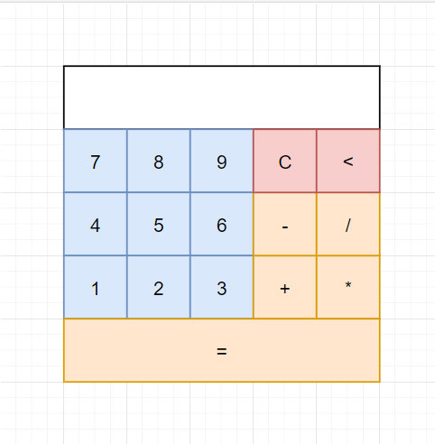

**самостоятелна работа**

# Калкулирай това 

Съюза на престарелите математици е притеснен от навлизащите информационни технологии в живота на младите хора. Верни на традициите на техните предци, големите глави вярват че могат да помогнат за създаването на перфектия калкулатор. Проблема е че интернета отдавна е подминал техните представи за модерна комуникации затова единствената помощ която могат да предоставят е много активни съвети и спецификация за създаването на продукта на бъдещето. Помогнете на сърдитите старчета да направят живота ни по лесен. Моля не им казвайте че калкулаторите същуствуват от векове, няма да ви разберат и ще вдигнат пенсионерски скандал. 

# Спецификация

създайте графичка и логическа и имплементация на калкулатор. Отделните еволюции на модерния виртуален прибур са дефинирани последователно, като към спецификацията е приложен и набор от изображения. С различни цветове сме определили, отделните компоненти. 

# Класически калкулатор

Калкулатора се състои от следните компоненти. 
* визуализация на числата
* бутони, с които да въвеждате цифричките.
* бутони за операциите (събиране / изваждане / умножение / деление)

Калкулатора имплементира набор от допълнителни помощни операции за управление на процеса :
* изтриване на резултата (C)
* изтриване на единична цифричка от въведената операция (<>)
* извеждане на резултатат (с различен цвят)

